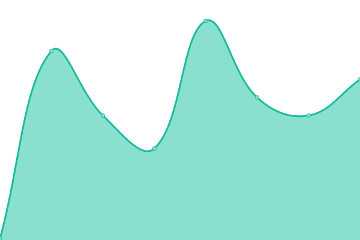
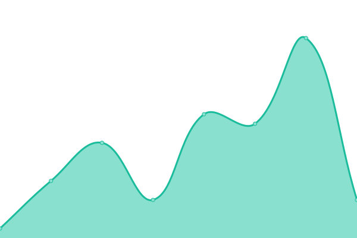
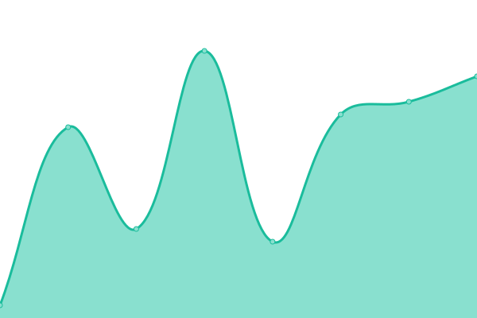
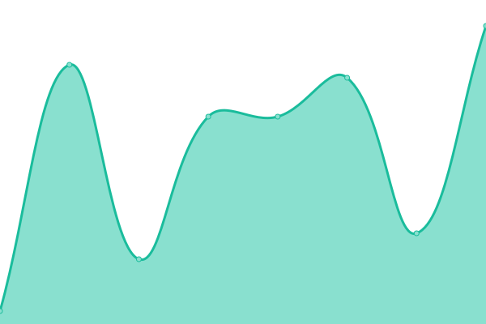
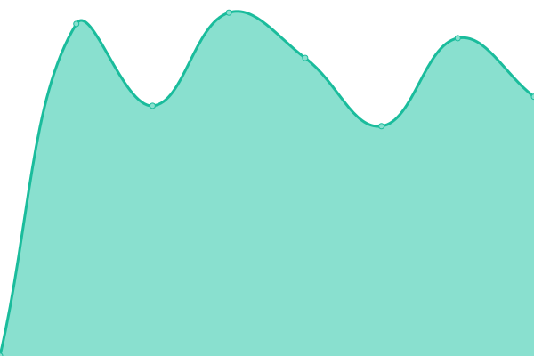

# [📈 Live Status](https://DrainPool.github.io/linsochlager-uptime): <!--live status--> **🟧 Partial outage**

This repository contains the open-source uptime monitor and status page for [DrainPool](https://DrainPool.github.io/linsochlager-uptime), powered by [Upptime](https://github.com/upptime/upptime).

With [Upptime](https://upptime.js.org), you can get your own unlimited and free uptime monitor and status page, powered entirely by a GitHub repository. We use [Issues](https://github.com/DrainPool/linsochlager-uptime/issues) as incident reports, [Actions](https://github.com/DrainPool/linsochlager-uptime/actions) as uptime monitors, and [Pages](https://DrainPool.github.io/linsochlager-uptime) for the status page.

<!--start: status pages-->
<!-- This summary is generated by Upptime (https://github.com/upptime/upptime) -->
<!-- Do not edit this manually, your changes will be overwritten -->
<!-- prettier-ignore -->
| URL | Status | History | Response Time | Uptime |
| --- | ------ | ------- | ------------- | ------ |
|  [Lins & Lager (Main)](https://linsochlager.net) | 🟥 Down | [lins-and-lager-main.yml](https://github.com/DrainPool/linsochlager-uptime/commits/HEAD/history/lins-and-lager-main.yml) | 

 141ms
     
 | 

<a href="https://DrainPool.github.io/linsochlager-uptime/history/lins-and-lager-main">0.00%</a>
    

|  [Shop](https://linsochlager.net/butik) | 🟥 Down | [shop.yml](https://github.com/DrainPool/linsochlager-uptime/commits/HEAD/history/shop.yml) | 

 9ms
     
 | 

<a href="https://DrainPool.github.io/linsochlager-uptime/history/shop">0.00%</a>
    

|  [Booking](https://linsochlager.net/boka) | 🟥 Down | [booking.yml](https://github.com/DrainPool/linsochlager-uptime/commits/HEAD/history/booking.yml) | 

 9ms
     
 | 

<a href="https://DrainPool.github.io/linsochlager-uptime/history/booking">0.00%</a>
    

|  [Photography](https://linsochlager.net/foto) | 🟥 Down | [photography.yml](https://github.com/DrainPool/linsochlager-uptime/commits/HEAD/history/photography.yml) | 

 9ms
     
 | 

<a href="https://DrainPool.github.io/linsochlager-uptime/history/photography">0.00%</a>
    

|  [Health Check](https://vpvzqdcvlershkzpvqle.supabase.co/functions/v1/check-system-health) | 🟩 Up | [health-check.yml](https://github.com/DrainPool/linsochlager-uptime/commits/HEAD/history/health-check.yml) | 

 1552ms
     
 | 

<a href="https://DrainPool.github.io/linsochlager-uptime/history/health-check">100.00%</a>
    

<!--end: status pages-->

[**Visit our status website →**](https://DrainPool.github.io/linsochlager-uptime)

## 📄 License

- Powered by: [Upptime](https://github.com/upptime/upptime)
- Code: [MIT](./LICENSE) © [Anand Chowdhary](https://anandchowdhary.com), supported by [Pabio](https://pabio.com)
- Data in the `./history` directory: [Open Database License](https://opendatacommons.org/licenses/odbl/1-0/)
